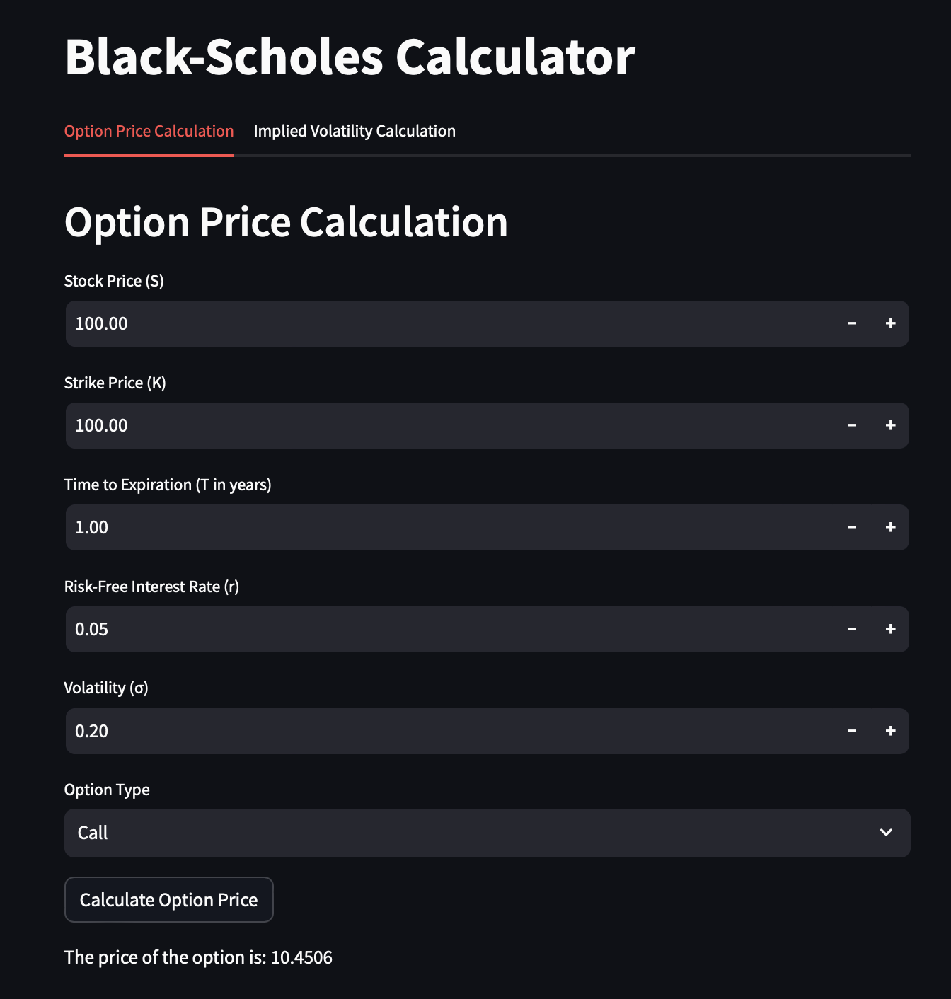

# Options Pricing JAX

## Overview 
This repository contains an implementation of the Black-Scholes model for option pricing, Greeks, and implied volatility, using JAX. The project aims to serve as a foundation for building a library for options pricing, with an eye for applications in machine learning. A Streamlit-based calculator app is also included as a practical demonstration and testing tool.

## Components
- `blackscholes.py`: Black-Scholes model functions for pricing and greeks, implemented with JAX.
- `app.py`: Calculator app for options pricing and implied volatility, built with Streamlit.


## Installation and Usage
For installation, clone the repository and install the required packages using pip:
```bash
pip install -r requirements.txt
```
To run the calculator app, use the following command:
```bash 
streamlit run app.py
```
##

